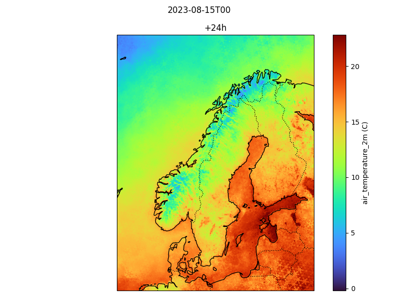
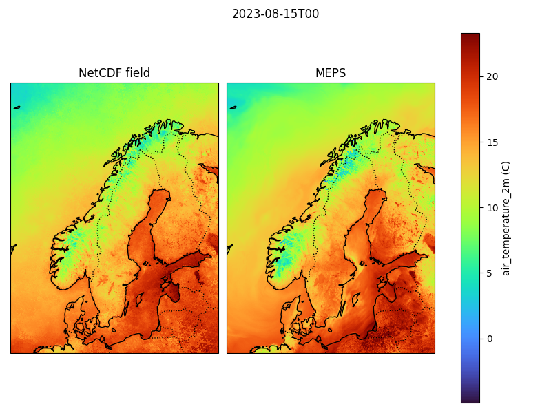
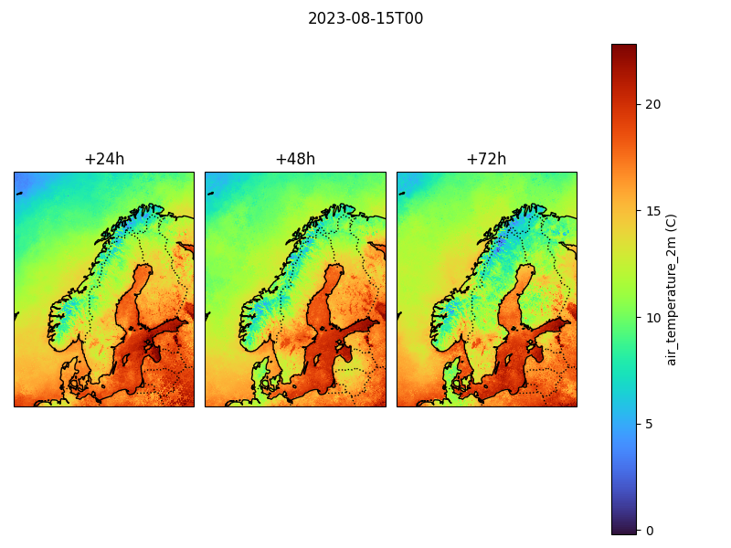

# anemoi-analyse
`anemoi-analyse` is a light-weight package for dealing with anemoi outputs, including inference and log files. The core features are:

- `Field plotter`: Plot and compare fields based on inference files
- `Verification`: Convert inference files to verification files
- `Loss plotter`: Plot loss based on log files

The package supports ensembles, regular and irregular grids and is able to compare loss across models, members and lead times.

## Documentation
The documentation pages can be found at:

[https://evenmn.github.io/anemoi-analyse](https://evenmn.github.io/anemoi-analyse)


## Basic usage

### `FieldPlotter`
The `FieldPlotter` can be used to plot fields in the inference files directly:
```python
from field_plotter import FieldPlotter

fp = FieldPlotter("field.nc", time='2023-08-15T00', model_label="NetCDF field")
fp.plot('air_temperature_2m', lead_times=4)
```



`time` is not strictly needed here, but is necessary if we want to compare to some reference (here MEPS):

```python
fp.plot('air_temperature_2m', lead_times=4, file_ref="meps.zarr")
```



```python
fp.plot('air_temperature_2m', lead_times=[4,8,12])
```



Of course, the `file_ref` and `lead_times` arguments can be combined for comparison across lead times. For more examples, see the [documentation](https://evenmn.github.io/anemoi-analyse).

### `LossPlotter`
One can plot the loss directly from the output file using the Python interface or the command-line interface `loss-plotter`: 
```bash
loss-plotter output1.out output2.out
```


## Install
To install the package, run
```bash
pip install git+https://github.com/evenmn/anemoi-analyse.git
```

## License
See [LICENSE](LICENSE) file.
